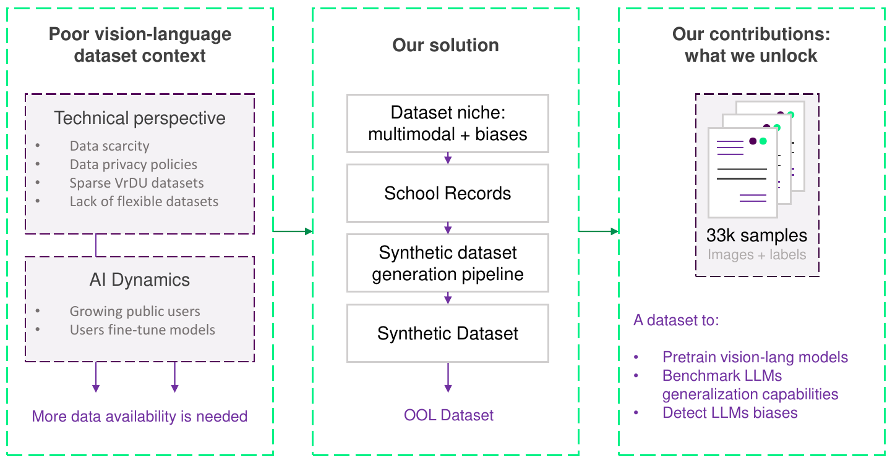
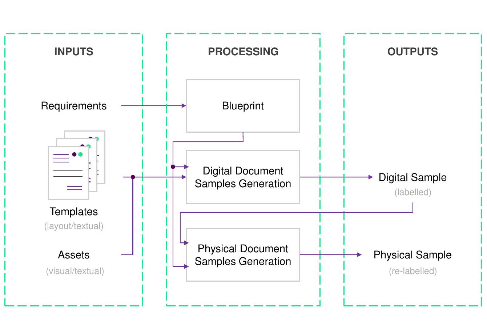
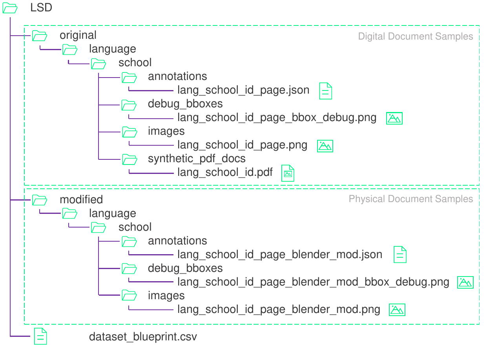

# The MERIT Dataset :school_satchel::page_with_curl::trophy:
### Modelling and Efficiently Rendering Interpretable Transcripts

The MERIT Dataset is a multimodal dataset (image + text + layout) designed for training and benchmarking Large Language Models (LLMs) on Visually Rich Document Understanding (VrDU) tasks.

**You can find more about our work here:**
+ **[Paper](https://arxiv.org/abs/2409.00447)**: Read all the details of our pipeline and dataset.
+ **The [MERIT Dataset](https://de-Rodrigo@huggingface.co/datasets/de-Rodrigo/merit)**. Explore the different plug&play Hugging Face 🤗 subsets.
+ **[Raw data](http://merit-dataset.s3-website.eu-north-1.amazonaws.com )**: Explore the Merit dataset raw data.
+ **Our [benchmark](https://wandb.ai/iderodrigo/MERIT-Dataset)**. We include all the details of our benchmark metrics.
+ **You can find our data generation pipeline in this repo.**


<p align="center" style="margin-top: 50px; margin-bottom: 50px;">
  
</p>


## Introduction :information_source:
AI faces some dynamic and technical issues that push end-users to create and gather their own data. In addition, multimodal LLMs are gaining more and more attention, but datasets to train them might be improved to be more complex, more flexible, and easier to gather/generate.

In this research project, we identify school transcripts of records as a suitable niche to generate a challenging multimodal dataset (image + text + layout) for Token Classification and Sequence Generation. **Thus, we introduce the multimodal [MERIT Dataset](https://de-Rodrigo@huggingface.co/datasets/de-Rodrigo/merit) (image + text + layout) and its generation pipeline.**

By introducing this dataset, we expect to contribute to:

+ Benchmarking LLMs' generalization capabilities.
+ Improving explainability in multimodal LLMs.
+ Detecting biases in LLMs.
+ Pretraining LLMs with more challenging data.
+ Solving the Token Classification task in a challenging context.

<p align="center" style="margin-top: 50px; margin-bottom: 50px;">
  
</p>


## Pipeline :arrows_counterclockwise:
Our generation pipeline consists of two modules: in the first one, we generate labeled digital samples, while in the second one, we transform these samples in Blender to improve photorealism and generate realistic scenarios.

<p align="center" style="margin-top: 50px; margin-bottom: 50px;">
  
</p>

To generate the digital samples, we start by defining 14 templates (7 in English and 7 in Spanish) in a text editor. These templates are populated with keywords that our pipeline replaces with text from databases (names, subjects, and grades). We classify the textual content of our dataset into more than 400 labels.

To transform our samples, we use a Blender module that can run cloth simulations to fold the document, apply textures over the document, or render with different lighting conditions.

<p align="center" style="margin-top: 50px; margin-bottom: 50px;">
  
</p>

**You can learn more details of our generation pipeline in our [paper](https://arxiv.org/abs/2409.00447).**

## Dataset :bookmark_tabs::camera:
Our dataset contains 33k multimodal samples and is fully labeled. In addition, it features a blueprint that gathers relevant data for every sample, including student name, average grade, rendering conditions, and more.

Each sample has two versions: one with Blender modifications and another without them. Additionally, each PNG is mapped to a JSON file where the labels are stored. The labels follow the FUNSD dataset format.


<p align="center" style="margin-top: 50px; margin-bottom: 50px;">
  
</p>


**You can download the [MERIT Datset](http://merit-dataset.s3-website.eu-north-1.amazonaws.com) raw data (please notice the complete dataset weights +200GB). You can train with our plug-and-play [subsets](https://de-Rodrigo@huggingface.co/datasets/de-Rodrigo/merit) by using the HuggingFace 🤗 pipeline.**

## Software :woman_technologist:

We run the pipeline on Ubuntu 20.04. It is designed to run on Windows too, although it has not been tested yet.

Requirements file under development :hammer_and_wrench:

## Hardware :gear:
We ran the pipeline on an MSI Meg Infinite X 10SF-666EU with an Intel Core i9-10900KF and an Nvidia RTX 2080 GPU, running on Ubuntu 20.04. Energy values in the table refer to 1k samples, and time values refer to one sample.

| Task                         | Energy (kWh) | Time (s) |
|------------------------------|--------------|----------|
| Generate digital samples     | 0.016        | 2        |
| Modify samples in Blender    | 0.366        | 34       |


## Benchmark :muscle:

We train the LayoutLM family models on token classification to demonstrate the suitability of our dataset. The MERIT Dataset poses a challenging scenario with more than 400 labels.

We benchmark on three scenarios with an increasing presence of Blender-modified samples.

+ Scenario 1: We train and test on digital samples.
+ Scenario 2: We train with digital samples and test with Blender-modified samples.
+ Scenario 3: We train and test with Blender-modified samples.


|                  | **Scenario 1** | **Scenario 2** | **Scenario 3** | **FUNSD/** | **Lang.** | **(Tr./Val./Test)** |
|------------------|----------------|----------------|----------------|------------|-----------|----------------------|
|                  | Dig./Dig.      | Dig./Mod.      | Mod./Mod       | XFUND      |           |                      |
|                  | F1         | F1         | F1         | F1     |           |                      |
| **LayoutLMv2**       | 0.5536         | 0.3764         | 0.4984         | 0.8276     | Eng.      | 7324 / 1831 / 4349       |
| **LayoutLMv3**       | 0.3452         | 0.2681         | 0.6370         | 0.9029     | Eng.      | 7324 / 1831 / 4349       |
| **LayoutXLM**        | 0.5977         | 0.3295         | 0.4489         | 0.7550     | Spa.      | 8115 / 2028 / 4426       |

**Access our [paper](https://arxiv.org/abs/2409.00447) to read our conclusions**. 


## Biases :detective:
Although synthetic, we acknowledge that our data generation involves sensitive topics. A solution to avoid biases might be to randomize students' grades. However, this approach would be useless if we want to detect biases in LLMs. Therefore, we have decided to associate students' grades based on [PISA](https://www.oecd-ilibrary.org/content/publication/53f23881-en) reports. **You can discover more information in the [paper](https://arxiv.org/abs/2409.00447)**.

| Educative System | Origin   | Country       | PISA Score                                                                                   | System Score |
|------------------|----------|---------------|----------------------------------------------------------------------------------------------|--------------|
| USA Schools      | English  | USA           | 490                                                                                          | 68           |
|                  | Spanish  | El Salvador   | 360                                                                                          | 46           |
|                  | Chinese  | China         | 528                                                                                    | 76           |
|                  | Indian   | India         | 336                                                                                    | 44           |
| Spanish Schools  | Spanish  | Spain         | 477                                                                                          | 6.54         |
|                  | Arabic   | Morocco       | 356                                                                                          | 4.56         |
|                  | Subsaharian | Senegal    | 306                                                                                     | 4.06         |


## Team

We are researchers from **[Comillas Pontifical University](https://www.iit.comillas.edu/)**
 - **Ignacio de Rodrigo [@nachoDRT](https://github.com/nachoDRT)**: PhD Student. Software Development, Dataset Curation, Benchmark Design.
 - **Alberto Sánchez [@ascuadrado](https://github.com/ascuadrado)**: Research Assistant. Software Development.
 - **Mauro Liz [@mauroliz](https://github.com/mauroliz)**: Research Assistant. Software Assistance.
 - **Jaime Boal [@jboal](https://github.com/jboalml)**: Supervisor.
 - **Álvaro López [@allopez](https://www.iit.comillas.edu/personas/allopez)**: Supervisor.

## Citation
If you find our research interesting, please cite our work. :page_with_curl::black_nib:

```bibtex
@article{de2024merit,
  title={The MERIT Dataset: Modelling and Efficiently Rendering Interpretable Transcripts},
  author={de Rodrigo, I and Sanchez-Cuadrado, A and Boal, J and Lopez-Lopez, AJ},
  journal={arXiv preprint arXiv:2409.00447},
  year={2024}
}